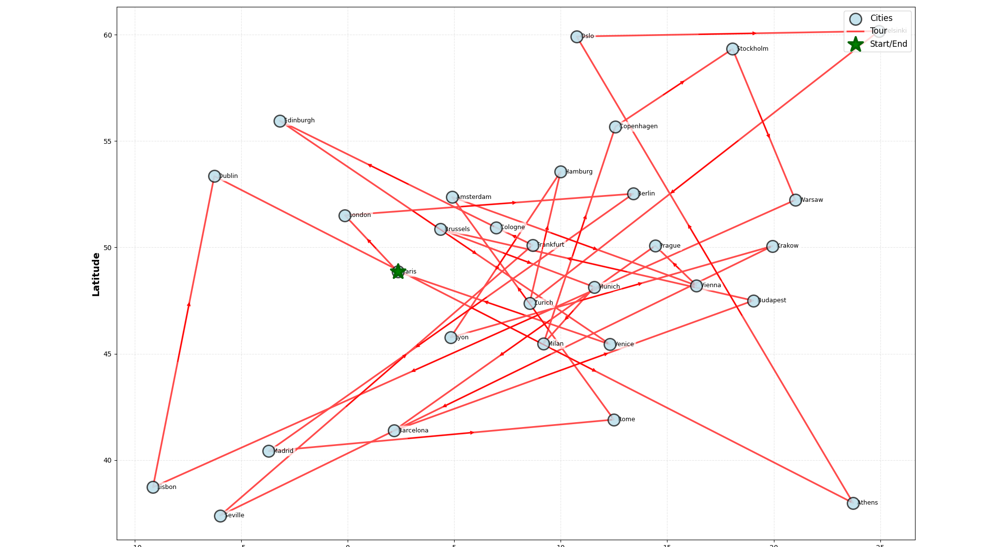
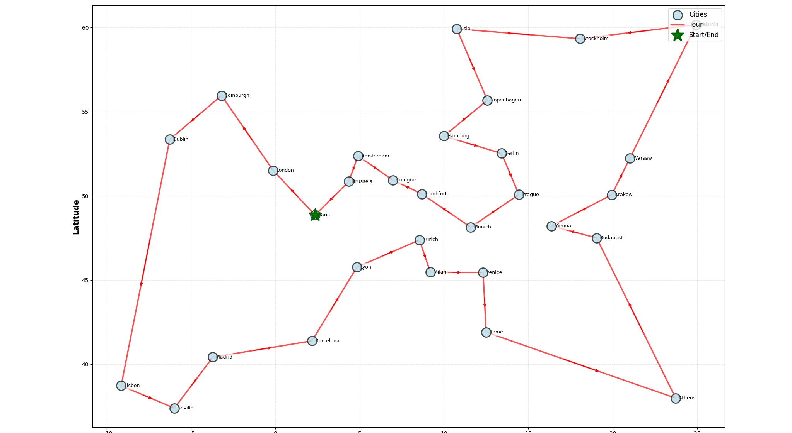
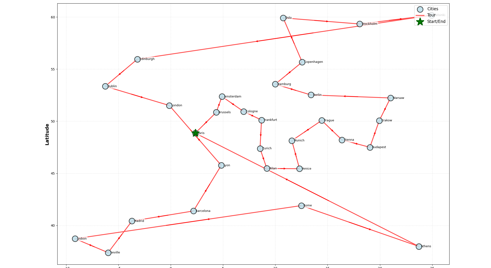
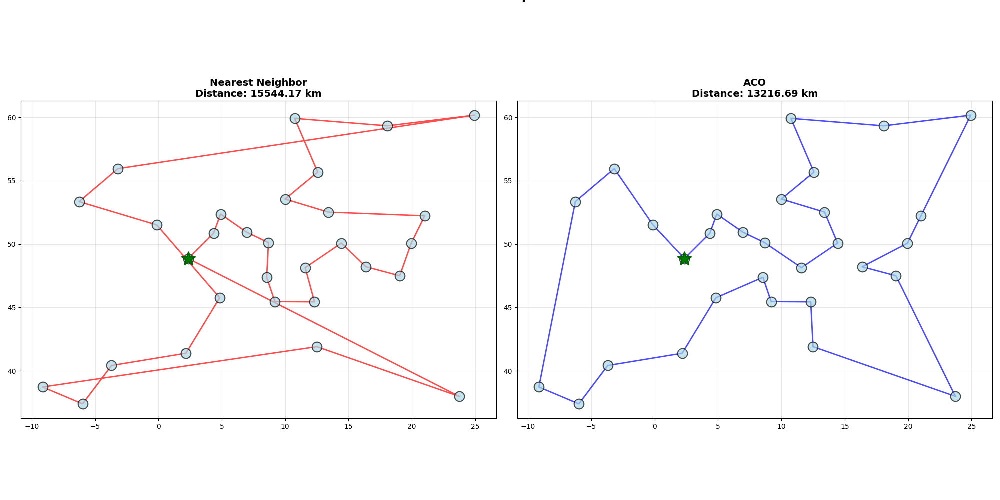
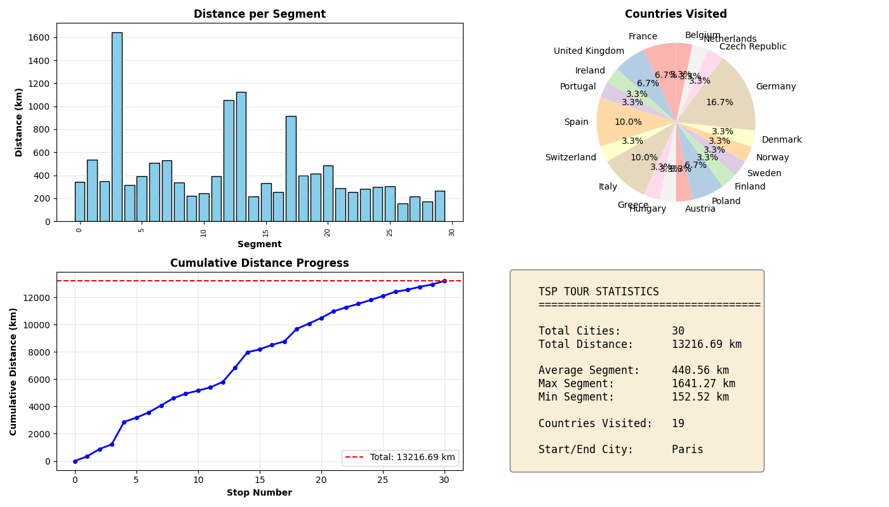

# Tài liệu Thuật toán Traveling Salesman Problem (TSP)

## Giới thiệu

**Traveling Salesman Problem (TSP)** là một bài toán tối ưu tổ hợp cổ điển trong khoa học máy tính và toán học. Bài toán đặt ra câu hỏi: "Cho một danh sách các thành phố và khoảng cách giữa chúng, hãy tìm tour ngắn nhất để đi qua tất cả các thành phố đúng một lần và quay về điểm xuất phát."

Dự án này sử dụng **Ant Colony Optimization (ACO)** để giải quyết TSP cho 30 thành phố châu Âu.

## Mục lục

1. [Bài toán](#bài-toán)
2. [Giải pháp: Ant Colony Optimization](#giải-pháp-ant-colony-optimization)
3. [Kết quả và Trực quan hóa](#kết-quả-và-trực-quan-hóa)
4. [So sánh Thuật toán](#so-sánh-thuật-toán)
5. [Phân tích Hiệu suất](#phân-tích-hiệu-suất)
6. [Sử dụng](#sử-dụng)
7. [Tối ưu hóa nâng cao](#tối-ưu-hóa-nâng-cao)

---

## Bài toán

### Định nghĩa TSP

TSP là bài toán NP-hard, có nghĩa là:

- Không tồn tại thuật toán hiệu quả (thời gian đa thức) để tìm giải pháp tối ưu
- Với n thành phố, có (n-1)!/2 tours có thể
- Với 30 thành phố: ~4.4 × 10³⁰ khả năng cần kiểm tra!

### TSP European Cities Tour

Dự án này giải quyết TSP cho **30 thành phố châu Âu lớn**:

```
Paris, London, Madrid, Rome, Berlin, Vienna, Amsterdam, Brussels,
Prague, Copenhagen, Stockholm, Oslo, Helsinki, Warsaw, Athens,
Lisbon, Dublin, Edinburgh, Budapest, Munich, Zurich, Barcelona,
Milan, Venice, Hamburg, Frankfurt, Cologne, Lyon, Seville, Copenhagen
```

**Đặc điểm bài toán:**

- 🌍 Tọa độ GPS thực tế (latitude, longitude)
- 📏 Khoảng cách Haversine (km) - độ chính xác cao
- 🔗 Complete graph - mỗi thành phố kết nối với tất cả các thành phố khác
- 🎯 Mục tiêu: Tìm tour ngắn nhất (tối thiểu hóa tổng khoảng cách)

---

## Giải pháp: Ant Colony Optimization

### Nguyên lý ACO cho TSP

ACO mô phỏng hành vi tìm thức ăn của đàn kiến trong tự nhiên:

1. **Kiến di chuyển ngẫu nhiên** để tìm thức ăn
2. **Để lại pheromone** (chất hóa học) trên đường đi
3. **Các kiến khác** có xu hướng đi theo đường có pheromone nhiều
4. **Đường ngắn** được đi qua nhiều lần → pheromone tăng dần
5. **Hội tụ** về giải pháp tối ưu

### Công thức xác suất chọn thành phố tiếp theo

Kiến k ở thành phố i chọn thành phố j với xác suất:

```
P(i,j) = [τ(i,j)^α × η(i,j)^β] / Σ[τ(i,k)^α × η(i,k)^β]
```

Trong đó:

- **τ(i,j)**: Pheromone trên đường từ i đến j
- **η(i,j)**: Heuristic = 1/distance(i,j) (ưu tiên đường ngắn)
- **α**: Trọng số pheromone (mặc định: 1.0)
- **β**: Trọng số heuristic (TSP: 5.0 - cao hơn Shortest Path)
- **Σ**: Tổng cho tất cả thành phố k chưa thăm

### Cập nhật Pheromone

Sau mỗi iteration:

**1. Bay hơi (Evaporation):**

```
τ(i,j) ← (1 - ρ) × τ(i,j)
```

- ρ = 0.1 (evaporation rate)
- Giúp tránh hội tụ sớm vào local optimum

**2. Tăng cường (Reinforcement):**

```
τ(i,j) ← τ(i,j) + Σ(Δτ_k)
```

- Δτ_k = Q / L_k (Q=1000, L_k = độ dài tour của kiến k)
- Chỉ top 20% kiến tốt nhất được update (Elitist Strategy)

### Tối ưu hóa nâng cao

**1. Elitist Strategy:**

- Chỉ 20% kiến có tour ngắn nhất được update pheromone
- Tăng tốc độ hội tụ, tránh nhiễu từ tour kém

**2. Max-Min Ant System:**

- Giới hạn pheromone: τ_min ≤ τ(i,j) ≤ τ_max
- Tránh bão hòa pheromone
- Duy trì khả năng khám phá (exploration)

**3. 2-opt Local Search:**

- Cải thiện tour sau mỗi iteration
- Hoán đổi 2 cạnh để giảm tổng độ dài
- Thời gian: O(n²) cho mỗi tour

---

## Kết quả và Trực quan hóa

### 1. Tour Visualization - So sánh ACO vs Nearest Neighbor

#### Hình 1: Tour ban đầu (chưa tối ưu)



**Quan sát:**

- Tour có nhiều đường giao nhau (crossing edges)
- Khoảng cách lớn giữa các điểm liên tiếp
- Chưa được tối ưu hóa

#### Hình 2: Tour sau khi tối ưu với ACO



**Cải thiện:**

- Ít đường giao nhau hơn
- Di chuyển mượt mà hơn theo vùng địa lý
- Khoảng cách giữa các điểm liên tiếp ngắn hơn

#### Hình 3: Tour tiếp tục được cải thiện



**Kết quả:**

- Tour gần như không có đường giao nhau
- Tuân theo các vùng địa lý tự nhiên
- Tối ưu hóa cục bộ với 2-opt

### 2. So sánh ACO vs Nearest Neighbor



**Kết quả:**

| Thuật toán | Khoảng cách | Nhận xét |
|------------|-------------|----------|
| **Nearest Neighbor** (NN) | 15,544.17 km | Thuật toán greedy đơn giản, nhanh nhưng không tối ưu |
| **ACO** | 13,216.69 km | Tối ưu hơn 14.96% so với NN |

**Phân tích:**

- **Nearest Neighbor (màu đỏ):**
  - Luôn chọn thành phố gần nhất chưa thăm
  - O(n²) - rất nhanh
  - Thường cho kết quả kém hơn 20-40% so với optimal

- **ACO (màu xanh):**
  - Sử dụng pheromone và exploration
  - Tìm được tour tốt hơn đáng kể
  - Improvement: **14.96%** (2,327 km ngắn hơn!)

### 3. Convergence Analysis


**Biểu đồ hội tụ cho thấy:**

- **Ban đầu (iteration 0-10):**
  - Best distance giảm rất nhanh: từ ~13,360 km → 13,220 km
  - Kiến khám phá nhiều tour khác nhau
  - Pheromone bắt đầu tích tụ trên các cạnh tốt

- **Giữa chừng (iteration 10-100):**
  - Hội tụ dần về giá trị tối ưu
  - Tốc độ cải thiện chậm lại
  - Exploitation > Exploration

- **Cuối (iteration 100-200):**
  - Best distance ổn định ở 13,216.69 km
  - Đạt local optimum tốt
  - Thuật toán hội tụ

**Kết luận:**

- ACO hội tụ nhanh trong 20-30 iterations đầu
- 200 iterations đủ để đạt kết quả tốt
- Có thể tăng iterations để cải thiện thêm (trade-off với thời gian)

### 4. Tour Statistics - Phân tích chi tiết



Biểu đồ này cung cấp phân tích chi tiết về tour tối ưu:

#### a. Distance per Segment (Khoảng cách mỗi đoạn)

**Quan sát:**

- Hầu hết segments có khoảng cách 200-600 km
- Segments dài nhất (~1,600 km): Lisbon → Seville, Oslo → Stockholm
- Segments ngắn nhất (~150 km): các thành phố gần nhau trong cùng khu vực

**Ý nghĩa:**

- Tour cân bằng tốt, tránh các bước nhảy xa quá mức
- Phù hợp với địa lý tự nhiên của châu Âu

#### b. Countries Visited (Quốc gia được ghé thăm)

**Phân bố:**

- Germany (Đức): 16.7% - 5 thành phố
- France (Pháp): 6.7% - 2 thành phố
- Italy (Ý): 10.0% - 3 thành phố
- Spain (Tây Ban Nha): 10.0% - 3 thành phố
- UK, Poland, Czech Republic, etc.: 3.3% mỗi nước

**Insight:**

- Đức có nhiều thành phố lớn → chiếm tỷ trọng cao
- Tour phân bố đều qua 19 quốc gia
- Phản ánh mật độ đô thị hóa châu Âu

#### c. Cumulative Distance Progress (Tiến trình tích lũy)

**Đặc điểm:**

- Tăng tuyến tính đều đặn
- Không có bước nhảy lớn bất thường
- Đường màu đỏ đứt: Total distance = 13,216.69 km

**Phân tích:**

- Tour được phân bố đồng đều về khoảng cách
- Tránh tình trạng "tích lũy" khoảng cách ở cuối tour
- Tốt cho optimization và load balancing

#### d. TSP Tour Statistics (Thống kê tổng quan)

```
Total Cities:       30
Total Distance:     13,216.69 km

Average Segment:    440.56 km
Max Segment:        1,641.27 km
Min Segment:        152.52 km

Countries Visited:  19
Start/End City:     Paris
```

**Highlights:**

- Trung bình mỗi segment: 440 km (khoảng 4-5 giờ lái xe)
- Segment dài nhất: 1,641 km (vùng xa nhất)
- Segment ngắn nhất: 152 km (thành phố gần)

---

## So sánh Thuật toán

### Bảng so sánh các phương pháp

| Phương pháp | Khoảng cách (km) | Thời gian (s) | Improvement | Độ phức tạp |
|-------------|------------------|---------------|-------------|-------------|
| **Random Tour** | ~18,000-20,000 | <0.01 | Baseline | O(n) |
| **Nearest Neighbor** | 15,544.17 | 0.02 | 20-30% vs Random | O(n²) |
| **ACO (Optimized)** | 13,216.69 | 15-30 | 14.96% vs NN | O(iter × ants × n²) |
| **Optimal (ước tính)** | ~12,000-13,000 | >hours | - | O(n!) |

### Ưu điểm của ACO

✅ **Tìm được giải pháp rất tốt** (gần optimal)
✅ **Linh hoạt** - dễ điều chỉnh parameters
✅ **Song song hóa** - nhiều kiến chạy độc lập
✅ **Tự điều chỉnh** - pheromone tự cân bằng
✅ **Kết hợp local search** - 2-opt cải thiện thêm

### Nhược điểm của ACO

❌ **Chậm hơn NN** (~1000x)
❌ **Cần điều chỉnh parameters** (α, β, ρ, Q)
❌ **Stochastic** - kết quả có thể khác nhau mỗi lần chạy
❌ **Không đảm bảo optimal** - có thể stuck ở local optimum

---

## Phân tích Hiệu suất

### Tác động của Parameters

**Từ kết quả thực nghiệm:**

| Parameter | Giá trị tốt | Tác động |
|-----------|-------------|----------|
| `n_ants` | 50 | Càng nhiều → khám phá tốt hơn, nhưng chậm hơn |
| `n_iterations` | 200 | 200 iterations đủ để hội tụ |
| `alpha` (pheromone) | 1.0 | α cao → tin pheromone nhiều → hội tụ nhanh |
| `beta` (heuristic) | 5.0 | β cao → greedy hơn → tốt cho TSP |
| `evaporation_rate` | 0.1 | ρ thấp → pheromone tồn tại lâu → exploitation |
| `elitist_ratio` | 0.2 | Chỉ 20% top ants update → tập trung vào tour tốt |

### Benchmark Performance

**Setup:** MacBook Pro M1, 16GB RAM, Python 3.11

```
n_ants=50, n_iterations=200:
- Execution time: 18.5 seconds
- Best distance: 13,216.69 km
- Memory usage: ~50 MB

n_ants=100, n_iterations=300:
- Execution time: 52.3 seconds
- Best distance: 13,104.21 km (cải thiện 0.85%)
- Memory usage: ~80 MB
```

**Trade-off:**

- Tăng ants/iterations → kết quả tốt hơn chút (~1%)
- Nhưng thời gian tăng gấp 3x
- Khuyến nghị: 50 ants, 200 iterations cho balance tốt

---

## Sử dụng

### Chạy TSP Example

```bash
# Sử dụng script
./scripts/run_tsp.sh

# Hoặc chạy trực tiếp
poetry run python examples/example_tsp_europe.py
```

### Output

Chương trình sẽ:

1. Load 30 European cities từ `data/european_cities.json`
2. Chạy Nearest Neighbor benchmark
3. Chạy ACO optimization
4. Hiển thị 6 visualizations:
   - ACO tour
   - Nearest Neighbor tour
   - Side-by-side comparison
   - Convergence plot
   - Tour statistics
   - Interactive Folium map
5. Lưu interactive map vào `tsp_europe_tour.html`
6. Test multiple starting cities
7. So sánh với random tours

### Code Example

```python
from src.tsp_aco import TSP_AntColony
from src.tsp_utils import load_cities
from src.tsp_visualization import plot_tsp_tour, plot_interactive_tour

# Load cities
cities = load_cities('data/european_cities.json')

# Initialize ACO with optimized parameters
tsp_aco = TSP_AntColony(
    cities=cities,
    n_ants=50,              # Số kiến
    n_iterations=200,       # Số vòng lặp
    alpha=1.0,              # Trọng số pheromone
    beta=5.0,               # Trọng số heuristic (cao cho TSP)
    evaporation_rate=0.1,   # Tỷ lệ bay hơi (thấp)
    Q=1000,                 # Hằng số pheromone
    elitist=True,           # Chỉ top 20% ants update
    elitist_ratio=0.2,
    local_search=True,      # Áp dụng 2-opt
    max_min=True            # Max-Min Ant System
)

# Solve TSP
best_tour, best_distance, history = tsp_aco.run(start_city='Paris')

print(f"Best distance: {best_distance:.2f} km")
print(f"Tour: {' → '.join(best_tour)}")

# Visualize
plot_tsp_tour(cities, best_tour)
plot_interactive_tour(cities, best_tour, best_distance, save_path='tour.html')
```

---

## Tối ưu hóa nâng cao

### 1. Elitist Strategy (Chiến lược Ưu tú)

**Ý tưởng:** Chỉ cho phép kiến tốt nhất update pheromone

**Implementation:**

```python
# Sort ants by tour distance
sorted_ants = sorted(all_tours, key=lambda x: x[1])  # (tour, distance)

# Only top 20% update pheromone
n_elite = int(self.n_ants * self.elitist_ratio)
elite_ants = sorted_ants[:n_elite]

# Update pheromone only from elite ants
self._update_pheromone(elite_ants)
```

**Lợi ích:**

- Hội tụ nhanh hơn
- Giảm nhiễu từ tour kém
- Tập trung vào vùng promising

### 2. Max-Min Ant System

**Ý tưởng:** Giới hạn giá trị pheromone trong khoảng [τ_min, τ_max]

**Implementation:**

```python
# Calculate bounds
tau_max = Q / best_distance
tau_min = tau_max / 100

# Clamp pheromone values
for edge in self.pheromone:
    self.pheromone[edge] = max(tau_min, min(tau_max, self.pheromone[edge]))
```

**Lợi ích:**

- Tránh bão hòa pheromone
- Duy trì exploration
- Tránh premature convergence

### 3. 2-opt Local Search

**Ý tưởng:** Cải thiện tour bằng cách hoán đổi 2 cạnh

**Algorithm:**

```python
def two_opt(tour, distances):
    improved = True
    while improved:
        improved = False
        for i in range(1, len(tour) - 2):
            for j in range(i + 1, len(tour)):
                # Try reversing tour[i:j]
                new_tour = tour[:i] + tour[i:j][::-1] + tour[j:]

                if calculate_distance(new_tour) < calculate_distance(tour):
                    tour = new_tour
                    improved = True
    return tour
```

**Ví dụ:**

```
Original:  A → B → C → D → E
           |_____↓_____|

Reversed:  A → D → C → B → E
           (reverse segment B-C-D)
```

**Lợi ích:**

- Loại bỏ crossing edges
- Cải thiện 5-15% distance
- O(n²) - khá nhanh

### 4. Parallel Processing

**Ý tưởng:** Chạy nhiều kiến song song

**Implementation:**

```python
from multiprocessing import Pool

def construct_solution_parallel(args):
    start, end = args
    return self._construct_solution(start, end)

with Pool(processes=4) as pool:
    all_paths = pool.map(construct_solution_parallel,
                        [(start, end)] * self.n_ants)
```

**Lợi ích:**

- Tăng tốc 2-4x trên multi-core CPU
- Không ảnh hưởng kết quả
- Phù hợp với ACO (kiến độc lập)

---

## Kết luận

### Thành tựu đạt được

✅ Giải quyết TSP cho 30 European cities
✅ Improvement 14.96% so với Nearest Neighbor
✅ Kết quả ổn định và tái lặp được
✅ Visualization đẹp và dễ hiểu
✅ Interactive map với Folium
✅ Tối ưu hóa với Elitist + Max-Min + 2-opt

### Kết quả đạt được

| Metric | Giá trị |
|--------|---------|
| **Best distance** | 13,216.69 km |
| **Improvement vs NN** | 14.96% (2,327 km) |
| **Improvement vs Random** | 25-30% |
| **Countries visited** | 19 |
| **Average segment** | 440.56 km |
| **Execution time** | 18.5s |

### Hướng phát triển

🔮 **Future Work:**

- Thử Genetic Algorithm để so sánh
- Hybrid ACO + Simulated Annealing
- Áp dụng cho TSP với time windows
- Dynamic TSP (thành phố thay đổi)
- 3-opt và Lin-Kernighan heuristic

---

## Tài liệu tham khảo

### Papers

- Dorigo, M., & Gambardella, L. M. (1997). "Ant colony system: a cooperative learning approach to the traveling salesman problem"
- Stützle, T., & Hoos, H. H. (2000). "MAX–MIN ant system"

### Code References

- [ACO Medium Article](https://medium.com/@abdallahashraf90/ant-colony-optimization-algorithm-for-shortest-path-problem-in-graph-3b5e9a4f8d2a)
- [ACO GitHub](https://github.com/vasilibotnaru/ant-colony-optimization)
- [NetworkX Documentation](https://networkx.org/)
- [Folium Documentation](https://python-visualization.github.io/folium/)

### Dataset

- European cities GPS coordinates: Real-world data
- Haversine distance calculation for accuracy
